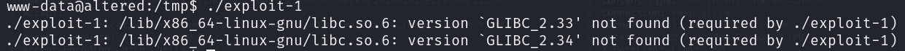
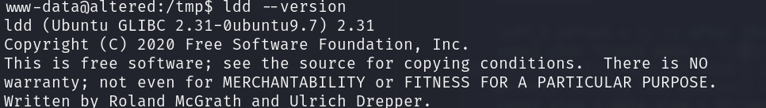

# Fix-Error-glibc
How to fix an error execution error of a file compiled in other host

# Error: [/lib/x86_x84-linu-gnu/libc.so.6: version 'GLIBC_2.33' not found]

## Description ans Cause

I was trying to execute an exploit (DirtyPipe) on a Hack The Box (HTB) machine. The exploit needs to be compiled with 'gcc', so I compiled it on my own host. However, when the compiled script was transferred to the victim host, it didn't run, and the following error appeared:

bash
/lib/x86_x84-linu-gnu/libc.so.6: version 'GLIBC_2.33' not found



This error occurs due to a mismatch in the glibc (GNU C Library) version between the host where the exploit was compiled and the host where it is being executed. The compiled program is incompatible with the glibc version on the victim host.


## Solution

To fix this error, you need to compile the exploit on a host with the same version of glibc as the target host. If you don't have a host with the required version, you can create a container with that version. First, you need to determine the glibc version on the target system. You can do this using the ldd command:

```bash
ldd --version

```



In my case, I needed a container with 'glibc' version 2.31. You can create this container using Docker (Ask Chat GTP which ubuntu's version you need):

```bash
docker run -it --rm ubuntu:20.04 bash

```

Check the glibc Version in the Docker container:

```bash
ldd --version

```

Install the gcc Compiler:

```bash
apt install gcc

```

Compile the Exploit:

```bash
gcc exploit.c -o exploit

```

Now transfer the compiled exploit to the victim's host and execute it.
